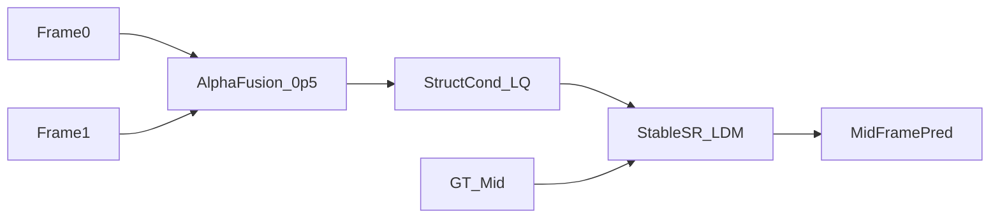

# MEMC 融合计划

## 目标

- 模型结构不变，通过 `alpha=0.5` 融合两帧作为单帧 LQ 输入，适配 MEMC 任务。
- 新增三元组数据集与训练配置，遵循 `frames/clip_xxxx/` 下 `frame_0001.png`（frame0）、`frame_0005.png`（gt_mid）、`frame_0010.png`（frame1）的组织方式，并使用给定的训练/验证根目录。
- 扩展现有推理入口以可选方式接收两张输入图，并与训练保持一致的融合方式。

## 核心改动

- **三元组数据集**：实现数据集读取 `frames/clip_xxxx/frame_0001.png`、`frame_0005.png`、`frame_0010.png`，执行对齐裁剪/增强，融合 `frame0`/`frame1` 得到 `lq`，并在 `basicsr/data/memc_triplet_dataset.py` 返回 `{lq, gt}`（含路径用于调试）。
- **训练配置**：在 [`configs/memc/`](configs/memc/) 下新增 MEMC 配置，使用 `LatentDiffusionSRTextWTFFHQ`（配对 LQ/GT 输入路径），指向训练根目录 `/workspace1/StableSR/StableSR_MEMC/dataset/sports_video_train_100` 与验证根目录 `/workspace1/StableSR/StableSR_MEMC/dataset/sports_video_valid_100`，并设置 `scale: 1` / `gt_size: 512`。
- **推理更新**：扩展 `predict.py` 与 `app.py` 支持第二张输入图；当提供双输入时，加载并对齐尺寸后按 `alpha=0.5` 融合，继续走现有的 latent 条件流程。

## 数据流（Mermaid）

## 实施说明

- 使用现有变换实现对齐裁剪/增强（`paired_random_crop`, `augment`），确保三帧一致性。
- `alpha` 默认 `0.5`，可在数据集/配置中作为可配置项（后续也可加 CLI/UI 参数）。
- 推理保持兼容：第二张输入可选，若只提供单张则保持原流程。
- 数据集根目录布局约定：
  - `frames/clip_xxxx/frame_0001.png`（frame0）
  - `frames/clip_xxxx/frame_0005.png`（gt_mid）
  - `frames/clip_xxxx/frame_0010.png`（frame1）

## 预计修改文件

- `basicsr/data/memc_triplet_dataset.py`
- `configs/memc/v2-finetune_text_T_512_memc.yaml`
- `predict.py`
- `app.py`

## 实施待办

- `add-triplet-dataset`: Add MEMC triplet dataset with fusion and aligned aug/crop.
- `add-memc-config`: Create MEMC training config using the new dataset and paired-input model class.
- `extend-infer`: Update `predict.py` and `app.py` to accept two inputs and apply alpha fusion.